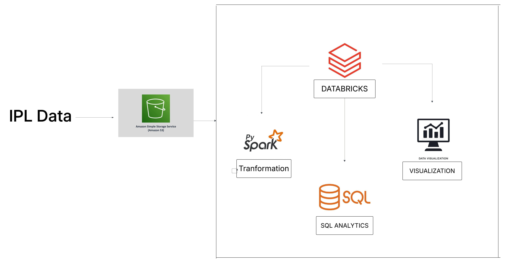

# IPL Apache Spark Real-Time Analysis

## Introduction 
This project performs data analysis on Indian Premier League (IPL) datasets using Apache Saprk and Databricks. It was developed as part of my Data Engineering learning journey. 

## Architecture

## Workflow
1. **IPL Dataset:** Raw datasets including ball-by-ball, player, and match details.
2. **Amazon S3:** Data is ingested and stored securely.
3. **Databricks Environment:**
      - **PySpark** for transformation
      - **SQL** for analytical querying
      - **Visualization** of results via Databricks dashboards

## Technologies used
- **Apache Spark** (Pyspark)
- **Amazon S3** (Storage)
- **Databricks**
- **Python**
- **SQL**

## Dataset used
the dataset used in this project was sourced from [data.world](https://data.world/raghu543/ipl-data-till-2017)
* Ball_By_Ball.csv - every ball's information
* Match.csv - metadata of each match
* Player.csv - player details
* Player_match.csv - mapping of players to matches
* Team.csv - team names and abbreviations

## Key Features

- Cleaned and transformed match data using Pyspark.
- Built structured datasets for teams, players, and performance stats.
- Executed Spark SQL queries to extract insights:
    * Most wins
    * Top Players
    * Match frequency by venue
- Visualized metrics like match outcomes and performance graphs.

## How to run
1. Upload datasets into Databricks or AWS S3.
2. Open the provided notebook from `/notebooks/workspace/`.
3. Attach to a cluster and run cells sequentially.
4. View output tables and dashboards.

## Libraries used
This project leverages a combination of PySpark and visualization libraries to perform scalable data processing and analysis.

* PySpark
  - `SparkSession`: To initialize and manage the Spark application.
  - `pyspark.sql.functions`: Used for column operations, aggregations, conditional logic, date transformations, and string formatting.
  - `pyspark.sql.types`: For defining structured schemas like StructType, StringType, IntegerType when reading raw CSV files.
  - `pyspark.sql.window`: Enables advanced analytics like ranking using row_number() and window partitions.

* Visualization Libraries
  - `matplotlib.pyplot`: Fow basic data visualization like bar plots or line charts.
  - `seaborn`: For enhanced statistical graphics and styled visualizations.

## Output
The final results are displayed using Databricks charts or can be exported to tools like Tableau or PowerBI. 

## Project Demo
[Watch the full walkthrough on YouTube](https://youtu.be/BplAB2eHZoA)
